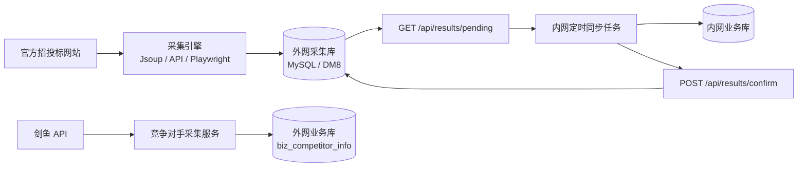

<div align="center">

# 招投标数据采集与同步服务

**从官方招投标网站采集公告与明细，并把外网数据可靠同步到内网。**

[简体中文](README.md) | [English](README_EN.md)


</div>

这是一个面向真实业务场景的招投标数据采集服务。项目已经在当前配置的公开招投标站点上完成实际采集验证，不仅能获取公告列表，还能进入详情页提取项目名称、招标人、中标人、中标金额、发布时间、原文链接等业务信息。

如果配置了你自己合法取得的剑鱼 API 凭据，服务还可以按竞争对手名称抓取相关招标、中标数据。采集结果可保存到 MySQL 或达梦 DM8，并通过“待同步拉取 + 成功确认”机制，让内网服务器的定时任务安全、可追踪地同步外网数据。

> [!IMPORTANT]
> 招投标网站的页面结构、验证码和访问策略可能随时变化。项目提供可配置选择器与站点专用 Handler，便于跟随上游变化进行维护，但不承诺任何第三方网站永久可用。

## 为什么选择它

| 能力 | 说明 |
| --- | --- |
| 官方数据源 | 面向公共资源交易中心等官方站点，按站点和公告类别独立配置 |
| 列表与明细 | 既可快速采集列表，也可进入详情页补全招投标业务字段 |
| 多种采集策略 | 基于 Jsoup 的通用采集、API 采集，以及 Playwright 动态页面采集 |
| 竞争对手跟踪 | 接入剑鱼 API 后，按企业名称采集竞争对手招标、中标信息 |
| 双数据库支持 | 内置 MySQL 与达梦 DM8 驱动、建表脚本和独立 Profile |
| 内外网同步 | 外网保存待同步记录，内网分页拉取，成功落库后回执确认 |
| 自动化调度 | Quartz 支持站点批量采集和剑鱼竞争对手数据的独立定时任务 |
| 可扩展架构 | 普通站点通过 YAML 选择器接入；复杂站点可增加专用 Handler |
| 接口鉴权 | 除健康检查和调试接口外，API 支持 `X-Crawler-Token` 鉴权 |

## 已配置的数据源

当前仓库包含以下站点和公告类别配置：

| 数据源 | 已配置类别 |
| --- | --- |
| 广州公共资源交易中心－水利水务 | 招标公告、资审结果、中标候选人、中标信息、中标结果、合同订立信息 |
| 广东省公共资源交易平台－水利工程 | 全部公告、招标公告、中标候选人、中标结果、合同公开 |
| 广西公共资源交易中心－水利工程 | 招标计划、交易公告、澄清变更、成交公示、中标结果等 |
| 云南省公共资源交易中心－水利工程 | 招标计划、招标公告、中标结果公示 |
| 海南公共资源交易中心－工程建设 | 招标公告、中标结果公告 |
| 中国采购与招标网－水利 | 招标公告 |

站点配置位于 [`src/main/resources/application.yml`](src/main/resources/application.yml)。某个站点能否正常访问，仍取决于运行环境网络、目标网站当前结构及其访问规则。

## 数据如何流动



同步采用确认式协议：未确认的数据保持 `synced=0`；内网成功落库后提交结果 ID，外网服务再标记为已同步。这样可以避免“数据还没写进内网，外网却提前删除或跳过”的问题。

## 技术栈

- Java 17、Spring Boot 3.1.4
- Quartz 定时任务
- Jsoup、Playwright、站点 API
- MyBatis-Plus、HikariCP
- MySQL、达梦 DM8
- Maven

## 快速开始

### 1. 环境要求

- JDK 17+
- Maven 3.8+
- MySQL 8.x 或达梦 DM8
- 能够访问目标招投标网站的网络环境

### 2. 获取项目

```bash
git clone https://github.com/lby-1/crawler-service.git
cd crawler-service
```

### 3. 初始化数据库

MySQL 使用：

```bash
mysql -u your_user -p your_database < src/main/resources/schema.sql
```

达梦 DM8 请使用数据库客户端执行 [`src/main/resources/schema-dm.sql`](src/main/resources/schema-dm.sql)。执行前请确认脚本中的 Schema 与你的部署环境一致。

### 4. 配置环境变量

MySQL 最小配置：

```bash
export SPRING_PROFILES_ACTIVE=mysql
export MYSQL_DB_URL='jdbc:mysql://127.0.0.1:3306/crawler?useUnicode=true&characterEncoding=utf-8&serverTimezone=Asia/Shanghai'
export MYSQL_DB_USERNAME='crawler_user'
export MYSQL_DB_PASSWORD='your_password'
export CRAWLER_AUTH_TOKEN='replace_with_a_strong_random_token'
```

<details>
<summary>PowerShell 示例</summary>

```powershell
$env:SPRING_PROFILES_ACTIVE = 'mysql'
$env:MYSQL_DB_URL = 'jdbc:mysql://127.0.0.1:3306/crawler?useUnicode=true&characterEncoding=utf-8&serverTimezone=Asia/Shanghai'
$env:MYSQL_DB_USERNAME = 'crawler_user'
$env:MYSQL_DB_PASSWORD = 'your_password'
$env:CRAWLER_AUTH_TOKEN = 'replace_with_a_strong_random_token'
```

</details>

如暂时不使用外部业务库或剑鱼功能，请在 `application-mysql.yml` 中关闭对应的 `enabled` 配置；否则还需要提供下表中的相关变量。

| 环境变量 | 用途 | 是否必需 |
| --- | --- | --- |
| `SPRING_PROFILES_ACTIVE` | 数据库 Profile，取值 `mysql` 或 `dm` | 建议显式设置 |
| `MYSQL_DB_URL` / `MYSQL_DB_USERNAME` / `MYSQL_DB_PASSWORD` | MySQL 主采集库 | MySQL 模式必需 |
| `DM_DB_URL` / `DM_DB_USERNAME` / `DM_DB_PASSWORD` | 达梦主采集库 | DM 模式必需 |
| `CRAWLER_AUTH_TOKEN` | 受保护接口的访问令牌 | 生产环境必需 |
| `EXTERNAL_BUSINESS_DB_URL` / `EXTERNAL_BUSINESS_DB_USERNAME` / `EXTERNAL_BUSINESS_DB_PASSWORD` | 外网业务库第二数据源 | 开启 `external-business` 时必需 |
| `JIANYU_APPID` / `JIANYU_KEY` | 你自己的剑鱼 API 凭据 | 开启剑鱼功能时必需 |
| `CHINABIDDING_PROXY_SERVER` / `CHINABIDDING_PROXY_USERNAME` / `CHINABIDDING_PROXY_PASSWORD` | 中国采购与招标网站点代理 | 使用该代理配置时必需 |

不要把真实密码、Token 或 API Key 写入仓库。生产环境建议由 systemd、容器 Secret 或专用密钥管理服务注入。

### 5. 构建并启动

```bash
mvn clean package -DskipTests
java -jar target/crawler-service-1.0.0.jar
```

也可以使用仓库中的 [`run.sh`](run.sh) 或 [`run.bat`](run.bat)。服务默认监听 `8090` 端口。

### 6. 验证服务

```bash
curl http://localhost:8090/api/health
curl http://localhost:8090/api/crawl/categories
curl 'http://localhost:8090/api/crawl/test/detail?category=zbgg&pages=1'
```

## API 概览

| 方法 | 路径 | 说明 | 默认鉴权 |
| --- | --- | --- | --- |
| `GET` | `/api/health` | 服务、数据库和待同步数据健康信息 | 无 |
| `GET` | `/api/crawl/categories` | 查看已配置站点与分类 | 无 |
| `GET` | `/api/crawl/test` | 快速采集列表 | 无 |
| `GET` | `/api/crawl/test/detail` | 采集列表并抓取详情 | 无 |
| `POST` | `/api/crawl/execute/all` | 异步执行全部站点和分类 | Token |
| `POST` | `/api/crawl/fetchDetail` | 按原文 URL 获取单条详情 | Token |
| `POST` | `/api/crawl/jianyu/competitors` | 采集剑鱼竞争对手数据 | Token |
| `GET` | `/api/crawl/status/{jobId}` | 查询异步任务状态 | Token |
| `GET` | `/api/results/pending` | 分页拉取尚未同步的数据 | Token |
| `POST` | `/api/results/confirm` | 确认指定结果已经同步 | Token |
| `GET` | `/api/results/all` | 分页查看全部结果，供调试使用 | 无 |

调用受保护接口时添加请求头：

```bash
curl -X POST 'http://localhost:8090/api/crawl/execute/all?pages=2&detail=true' \
  -H "X-Crawler-Token: ${CRAWLER_AUTH_TOKEN}"
```

拉取并确认同步数据：

```bash
curl 'http://localhost:8090/api/results/pending?limit=200' \
  -H "X-Crawler-Token: ${CRAWLER_AUTH_TOKEN}"

curl -X POST 'http://localhost:8090/api/results/confirm' \
  -H 'Content-Type: application/json' \
  -H "X-Crawler-Token: ${CRAWLER_AUTH_TOKEN}" \
  -d '{"resultIds":["result-id-1","result-id-2"]}'
```

## 内外网同步建议

1. 外网服务按照 Quartz 配置定期采集数据，并将新记录保存为 `synced=0`。
2. 内网服务器的定时任务通过网闸、反向代理或允许的网络通道调用 `/api/results/pending`。
3. 内网完成事务性落库后，再调用 `/api/results/confirm` 回传成功的结果 ID。
4. 请求失败时不要确认；下一轮任务会重新获取尚未确认的数据。
5. 内网落库逻辑应以结果 ID 或业务唯一键实现幂等，防止重试产生重复数据。

仓库提供外网侧的查询和确认接口；内网侧任务应根据你的网络隔离方案、目标表结构和调度平台实现。

## 配置与扩展

### 调整采集计划

站点批量任务和剑鱼任务使用独立的 Quartz Cron：

```yaml
crawler:
  schedule:
    enabled: true
    cron: "0 0 */6 * * ?"
  jianyu:
    schedule:
      enabled: true
      cron: "0 30 2 * * ?"
```

### 接入新站点

1. 优先在 `crawler.sites` 下配置列表 URL、分页规则和 CSS 选择器。
2. 如果站点提供稳定 JSON API，可参考现有 API 采集引擎。
3. 如果页面依赖 JavaScript 渲染，可启用 Playwright。
4. 如果页面结构或详情解析非常特殊，在 `engine/handler/site` 下实现专用 Handler。
5. 先用 `/api/crawl/test` 验证列表，再用 `/api/crawl/test/detail` 验证明细。

## 部署

[`deploy`](deploy) 目录提供：

- 外置 Spring 配置示例；
- Linux 启动脚本；
- systemd 服务定义；
- 安装命令示例；
- Windows 服务 XML 示例。

部署前请按实际服务器修改路径、运行账户、JDK 位置和资源参数，并通过环境变量注入所有凭据。

## 项目结构

```text
src/main/java/com/jpwise/crawler/
├── config/                 # 配置、鉴权、数据源和异常处理
├── controller/             # 采集、结果同步和健康检查 API
├── engine/                 # 通用、API 与 Playwright 采集引擎
│   └── handler/site/       # 各站点专用解析器
├── entity/                 # 采集结果与日志实体
├── mapper/                 # MyBatis-Plus Mapper
├── scheduler/              # Quartz 采集任务
└── service/                # 采集编排与剑鱼竞争对手服务

src/main/resources/
├── application.yml         # 通用配置与站点定义
├── application-mysql.yml   # MySQL、外部业务库和剑鱼配置
├── application-dm.yml      # 达梦配置
├── schema.sql              # MySQL 建表脚本
└── schema-dm.sql           # 达梦建表脚本
```

## 使用边界

- 请遵守目标网站的服务条款、robots 规则、访问频率限制及所在地法律法规。
- 仅采集你有权访问和处理的数据，不要绕过登录、验证码或技术保护措施。
- 剑鱼功能需要你自行取得并妥善保管合法 API 凭据。
- 建议设置合理的 `default-req-interval`，避免给目标网站造成额外压力。
- 生产环境不要依赖当前白名单调试接口；应结合网络边界、网关和访问控制进一步加固。

## 参与贡献

欢迎提交 Issue 或 Pull Request，尤其是：

- 修复目标网站改版导致的解析问题；
- 增加新的官方数据源或公告类型；
- 改进字段标准化、去重和幂等同步；
- 补充可复现的测试样例与脱敏页面 Fixture；
- 完善部署、安全和运维文档。

提交代码时请勿包含真实数据库地址、账号、密码、Token、Cookie 或付费接口凭据。

## License

本项目采用 [MIT License](LICENSE)。
