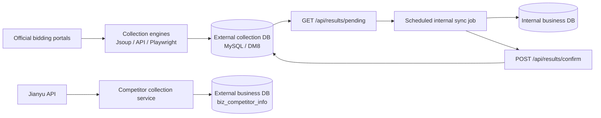

<div align="center">

# Bidding Data Crawler & Sync Service

**Collect notices and full tender details from official portals, then move the data safely from an internet-facing environment to an internal network.**

[简体中文](README.md) | [English](README_EN.md)


</div>

This is a bidding-data collection service built for real deployment scenarios. The configured public procurement sources have been exercised with live collection: the service can collect listing pages, open each notice, and extract practical fields such as project name, tendering entity, winning bidder, award amount, publication time, and source URL.

With your own authorized Jianyu API credentials, it can also track tender and award activity associated with named competitors. Results can be stored in MySQL or DM8, while a pull-and-confirm protocol lets scheduled jobs move pending records from an internet-facing database into an internal network in a traceable way.

> [!IMPORTANT]
> Third-party portals can change their markup, CAPTCHA, and access policies at any time. Configurable selectors and site-specific handlers make maintenance practical, but this project cannot guarantee permanent compatibility with any external site.

## Why this project

| Capability | What it provides |
| --- | --- |
| Official sources | Per-site and per-category configuration for public resource trading portals |
| Listings and details | Fast listing collection plus optional navigation into full notice pages |
| Multiple strategies | Generic Jsoup parsing, API-based collection, and Playwright for dynamic pages |
| Competitor tracking | Jianyu integration for tender and award records associated with company names |
| Two database families | Drivers, profiles, and schema scripts for both MySQL and DM8 |
| Network-zone synchronization | Pending records on the external side, paged pulls, and explicit acknowledgements |
| Automated schedules | Independent Quartz jobs for portal crawling and Jianyu competitor collection |
| Extensible site support | YAML selectors for regular sites and dedicated handlers for complex sources |
| API authentication | `X-Crawler-Token` protection for non-public operational endpoints |

## Configured sources

The repository currently includes configurations for these portals and categories:

| Source | Configured categories |
| --- | --- |
| Guangzhou Public Resources Trading Center — Water Affairs | Tender notices, qualification results, award candidates, award information, award results, contracts |
| Guangdong Public Resources Trading Platform — Water Engineering | All notices, tender notices, award candidates, award results, contracts |
| Guangxi Public Resources Trading Center — Water Engineering | Tender plans, transaction notices, amendments, transaction announcements, award results |
| Yunnan Public Resources Trading Center — Water Engineering | Tender plans, tender notices, award results |
| Hainan Public Resources Trading Center — Construction | Tender notices and award notices |
| China Bidding and Procurement Network — Water | Tender notices |

Source definitions live in [`src/main/resources/application.yml`](src/main/resources/application.yml). Actual availability still depends on network access, the current upstream structure, and each portal's access policy.

## Data flow



Synchronization uses explicit acknowledgement. Records remain at `synced=0` until the internal side has stored them successfully and confirms their IDs. A failed transfer therefore remains available for a later retry.

## Technology

- Java 17 and Spring Boot 3.1.4
- Quartz Scheduler
- Jsoup, Playwright, and site APIs
- MyBatis-Plus and HikariCP
- MySQL and DM8
- Maven

## Quick start

### 1. Requirements

- JDK 17+
- Maven 3.8+
- MySQL 8.x or DM8
- Network access to the target bidding portals

### 2. Clone the repository

```bash
git clone https://github.com/lby-1/crawler-service.git
cd crawler-service
```

### 3. Initialize the database

For MySQL:

```bash
mysql -u your_user -p your_database < src/main/resources/schema.sql
```

For DM8, run [`src/main/resources/schema-dm.sql`](src/main/resources/schema-dm.sql) with your database client. Review the target schema before applying it to your environment.

### 4. Set environment variables

Minimal MySQL configuration:

```bash
export SPRING_PROFILES_ACTIVE=mysql
export MYSQL_DB_URL='jdbc:mysql://127.0.0.1:3306/crawler?useUnicode=true&characterEncoding=utf-8&serverTimezone=Asia/Shanghai'
export MYSQL_DB_USERNAME='crawler_user'
export MYSQL_DB_PASSWORD='your_password'
export CRAWLER_AUTH_TOKEN='replace_with_a_strong_random_token'
```

<details>
<summary>PowerShell example</summary>

```powershell
$env:SPRING_PROFILES_ACTIVE = 'mysql'
$env:MYSQL_DB_URL = 'jdbc:mysql://127.0.0.1:3306/crawler?useUnicode=true&characterEncoding=utf-8&serverTimezone=Asia/Shanghai'
$env:MYSQL_DB_USERNAME = 'crawler_user'
$env:MYSQL_DB_PASSWORD = 'your_password'
$env:CRAWLER_AUTH_TOKEN = 'replace_with_a_strong_random_token'
```

</details>

If you are not using the external business database or Jianyu integration, disable the corresponding `enabled` settings in `application-mysql.yml`. Otherwise, provide their variables as well.

| Environment variable | Purpose | Required when |
| --- | --- | --- |
| `SPRING_PROFILES_ACTIVE` | Database profile: `mysql` or `dm` | Recommended explicitly |
| `MYSQL_DB_URL` / `MYSQL_DB_USERNAME` / `MYSQL_DB_PASSWORD` | Primary MySQL collection database | MySQL profile is active |
| `DM_DB_URL` / `DM_DB_USERNAME` / `DM_DB_PASSWORD` | Primary DM8 collection database | DM profile is active |
| `CRAWLER_AUTH_TOKEN` | Token for protected API operations | Always in production |
| `EXTERNAL_BUSINESS_DB_URL` / `EXTERNAL_BUSINESS_DB_USERNAME` / `EXTERNAL_BUSINESS_DB_PASSWORD` | Secondary external business database | `external-business` is enabled |
| `JIANYU_APPID` / `JIANYU_KEY` | Your authorized Jianyu API credentials | Jianyu integration is enabled |
| `CHINABIDDING_PROXY_SERVER` / `CHINABIDDING_PROXY_USERNAME` / `CHINABIDDING_PROXY_PASSWORD` | Optional proxy for the China Bidding source | That proxy configuration is used |

Never commit real passwords, tokens, or API keys. Inject them with systemd, container secrets, or a dedicated secret manager in production.

### 5. Build and run

```bash
mvn clean package -DskipTests
java -jar target/crawler-service-1.0.0.jar
```

You can also use [`run.sh`](run.sh) or [`run.bat`](run.bat). The service listens on port `8090` by default.

### 6. Check the service

```bash
curl http://localhost:8090/api/health
curl http://localhost:8090/api/crawl/categories
curl 'http://localhost:8090/api/crawl/test/detail?category=zbgg&pages=1'
```

## API overview

| Method | Path | Purpose | Default auth |
| --- | --- | --- | --- |
| `GET` | `/api/health` | Service, database, and pending-record health | None |
| `GET` | `/api/crawl/categories` | List configured sites and categories | None |
| `GET` | `/api/crawl/test` | Run a quick listing crawl | None |
| `GET` | `/api/crawl/test/detail` | Crawl listings and fetch their details | None |
| `POST` | `/api/crawl/execute/all` | Run all configured sites and categories asynchronously | Token |
| `POST` | `/api/crawl/fetchDetail` | Fetch one detail page by source URL | Token |
| `POST` | `/api/crawl/jianyu/competitors` | Collect Jianyu competitor records | Token |
| `GET` | `/api/crawl/status/{jobId}` | Read asynchronous job status | Token |
| `GET` | `/api/results/pending` | Page through records not yet synchronized | Token |
| `POST` | `/api/results/confirm` | Acknowledge successfully synchronized result IDs | Token |
| `GET` | `/api/results/all` | Page through all results for debugging | None |

Add the authentication header to protected requests:

```bash
curl -X POST 'http://localhost:8090/api/crawl/execute/all?pages=2&detail=true' \
  -H "X-Crawler-Token: ${CRAWLER_AUTH_TOKEN}"
```

Pull and acknowledge synchronized records:

```bash
curl 'http://localhost:8090/api/results/pending?limit=200' \
  -H "X-Crawler-Token: ${CRAWLER_AUTH_TOKEN}"

curl -X POST 'http://localhost:8090/api/results/confirm' \
  -H 'Content-Type: application/json' \
  -H "X-Crawler-Token: ${CRAWLER_AUTH_TOKEN}" \
  -d '{"resultIds":["result-id-1","result-id-2"]}'
```

## External-to-internal sync guidance

1. The internet-facing service runs scheduled crawls and stores new records with `synced=0`.
2. A scheduled job on the internal side calls `/api/results/pending` through an approved gateway, proxy, or network channel.
3. After committing the records locally, the internal job calls `/api/results/confirm` with the successful result IDs.
4. Failed batches must not be confirmed; they will remain available on the next run.
5. Make the internal write idempotent by result ID or a stable business key so retries cannot create duplicates.

This repository provides the external pull and acknowledgement APIs. Implement the internal consumer according to your network isolation controls, target schema, and scheduling platform.

## Configuration and extension

### Change schedules

Portal collection and Jianyu collection use independent Quartz expressions:

```yaml
crawler:
  schedule:
    enabled: true
    cron: "0 0 */6 * * ?"
  jianyu:
    schedule:
      enabled: true
      cron: "0 30 2 * * ?"
```

### Add a source

1. Start with a `crawler.sites` entry containing the listing URL, pagination rule, and CSS selectors.
2. Use the API engine when a stable JSON endpoint is available.
3. Enable Playwright when the page requires JavaScript rendering.
4. Add a dedicated handler under `engine/handler/site` for source-specific detail parsing.
5. Verify listings with `/api/crawl/test`, then verify full details with `/api/crawl/test/detail`.

## Deployment

The [`deploy`](deploy) directory contains:

- external Spring configuration examples;
- a Linux launcher;
- a systemd service definition;
- installation command examples;
- a Windows service XML example.

Before deployment, adapt paths, service accounts, the JDK location, and memory limits. Inject every credential through environment variables.

## Project layout

```text
src/main/java/com/jpwise/crawler/
├── config/                 # Configuration, auth, data sources, errors
├── controller/             # Crawling, synchronization, and health APIs
├── engine/                 # Generic, API, and Playwright engines
│   └── handler/site/       # Source-specific parsers
├── entity/                 # Collection result and log entities
├── mapper/                 # MyBatis-Plus mappers
├── scheduler/              # Quartz collection jobs
└── service/                # Crawl orchestration and Jianyu integration

src/main/resources/
├── application.yml         # Shared settings and source definitions
├── application-mysql.yml   # MySQL, external business DB, and Jianyu
├── application-dm.yml      # DM8 profile
├── schema.sql              # MySQL schema
└── schema-dm.sql           # DM8 schema
```

## Responsible use

- Follow each source site's terms, robots policy, rate limits, and applicable law.
- Collect only data you are authorized to access and process. Do not bypass login, CAPTCHA, or technical safeguards.
- Obtain and protect your own authorized Jianyu API credentials.
- Use a reasonable `default-req-interval` to avoid unnecessary load on upstream sites.
- Do not rely on the current debugging whitelist in production; add network, gateway, and access-control hardening appropriate to your environment.

## Contributing

Issues and pull requests are welcome, particularly for:

- fixes following upstream markup changes;
- new official sources or notice categories;
- better normalization, deduplication, and idempotent synchronization;
- reproducible tests with sanitized page fixtures;
- stronger deployment, security, and operations documentation.

Never include real database endpoints, accounts, passwords, tokens, cookies, or paid API credentials in a contribution.

## License

This project is available under the [MIT License](LICENSE).
